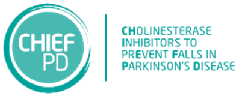

## Recent research outputs

# Outputs and Activities

## [CHIEF-PD]([./CHIEF-PD](http://www.bris.ac.uk/chief-pd))

The CHIEF-PD trial is a medical research trial examining whether drugs normally used to treat people with memory problems can be used to reduce the number of falls that people with Parkinson’s experience. The trial aims to recruit 600 participants over 2 years from 26 sites around the UK. 

For more information, please visit the [CHIEF-PD website]([./CHIEF-PD](http://www.bris.ac.uk/chief-pd))
### Peer-reviewed publications
(journal articles, chapters, books, etc.)
- `<PUBLICATION 1>`
- `<PUBLICATION 2>`

### Non peer-reviewed publications
(preprints, documentation, posters, reports, policy briefs, popular articles and books, blogs, etc.)
- `<PUBLICATION 1>`
- `<PUBLICATION 2>`

### Academic events
(conferences, workshops, hackathons, panels, courses, etc.)
- `<EVENT 1>`
- `<EVENT 2>`

# PRIME Parkinson

## [PRIME-RCT]([./PRIME-RCT](https://primeparkinson.blogs.bristol.ac.uk/))

The Prime Parkinson UK project is a research project aiming to develop a new model of care for people with Parkinson's Disease. The five year trial, led by Dr Emily Henderson, will see the implementation of a new integrated care model designed specifically for people with Parkinson’s disease across two health hubs in Bath, UK and Nijmegen, Netherlands.

### Peer-reviewed publications
(journal articles, chapters, books, etc.)
- `<PUBLICATION 1>`
- `<PUBLICATION 2>`

### Non peer-reviewed publications
(preprints, documentation, posters, reports, policy briefs, popular articles and books, blogs, etc.)
- `<PUBLICATION 1>`
- `<PUBLICATION 2>`

### Academic events
(conferences, workshops, hackathons, panels, courses, etc.)
- `<EVENT 1>`
- `<EVENT 2>`

## [PRIME Cross-Sectional](./PRIME-XS)

`<BRIEF DESCRIPTION OF PROJECT>`

### Peer-reviewed publications
(journal articles, chapters, books, etc.)
- `<PUBLICATION 1>`
- `<PUBLICATION 2>`

### Non peer-reviewed publications
(preprints, documentation, posters, reports, policy briefs, popular articles and books, blogs, etc.)
- `<PUBLICATION 1>`
- `<PUBLICATION 2>`

### Academic events
(conferences, workshops, hackathons, panels, courses, etc.)
- `<EVENT 1>`
- `<EVENT 2>`

## [PRIME-EPI](./PRIME-EPI)

`<BRIEF DESCRIPTION OF PROJECT>`

### Peer-reviewed publications
(journal articles, chapters, books, etc.)
- `<PUBLICATION 1>`
- `<PUBLICATION 2>`

### Non peer-reviewed publications
(preprints, documentation, posters, reports, policy briefs, popular articles and books, blogs, etc.)
- `<PUBLICATION 1>`
- `<PUBLICATION 2>`

### Academic events
(conferences, workshops, hackathons, panels, courses, etc.)
- `<EVENT 1>`
- `<EVENT 2>`

## [Developing Medical Education in Geriatrics]([./GerisMedEd](https://gerismeded.blogs.bristol.ac.uk/))

As Bristol Medical School transitions from MB16 to the new MB21 curriculum, it offers a unique opportunity for evaluation and innovation in medical education. This project will be tracking the impact of the expanded 18 week programme in geriatric medicine on short-term and long-term outcomes for Bristol undergraduates. This work is generously supported by funding from The Dunhill Medical Trust.

 You can follow our progress on Twitter @GerisMedEd  and head to our website for more information. 

### Peer-reviewed publications
(journal articles, chapters, books, etc.)
- `<PUBLICATION 1>`
- `<PUBLICATION 2>`

### Non peer-reviewed publications
(preprints, documentation, posters, reports, policy briefs, popular articles and books, blogs, etc.)
- `<PUBLICATION 1>`
- `<PUBLICATION 2>`

### Academic events
(conferences, workshops, hackathons, panels, courses, etc.)
- `<EVENT 1>`
- `<EVENT 2>`

## [Other](./other)

`<BRIEF DESCRIPTION OF PROJECT>`

### Peer-reviewed publications
(journal articles, chapters, books, etc.)
- `<PUBLICATION 1>`
- `<PUBLICATION 2>`

### Non peer-reviewed publications
(preprints, documentation, posters, reports, policy briefs, popular articles and books, blogs, etc.)
- `<PUBLICATION 1>`
- `<PUBLICATION 2>`

### Academic events
(conferences, workshops, hackathons, panels, courses, etc.)
- `<EVENT 1>`
- `<EVENT 2>`
